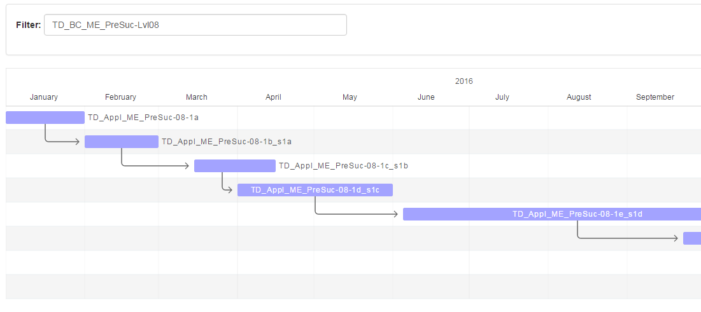

# scope/content

The barchart report shows applications and their predecessor/successor-relations.

# source code

[https://github.com/leanix/leanix-custom-reports/blob/master/predecessor-successor/src](https://github.com/leanix/leanix-custom-reports/blob/master/predecessor-successor/src) 

# screenshot

# requirements

1. time line
1. use arrows to visualize the predecessors/successors-relations
1. bar (application) starts with lifecycle 'activ' (if not available with 'phase in' or 'plan')
1. bar (application) ends with lifecycle 'end of life' (if not available with 'phase out')
1. don't show applications without lifecycle informations
1. filter by business capabilities

# test data

1. stored in testdata/
1. all test data are tagged with 'TD-ME-PreSuc'
1. import in your test or demo workspace
1. some applications contain in their names the application numbers, for which they are successors (_s...)
1. first load business capabilities bc.xls in 2 steps:
	1. without column C 'Parent'
	1. with column C 'Parent'
1. second load applications app.xls in 2 steps:
	1. without column S 'Successors'
	1. with column S 'Successors'
