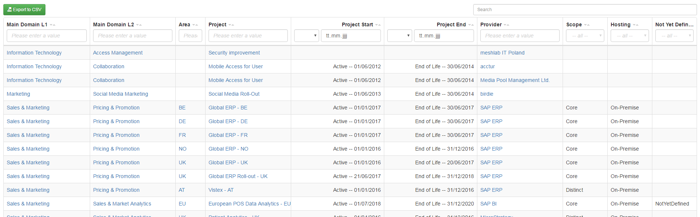

# scope/content

The table report shows the influence of projects on business capabilities. In the sence of a roadmap is a tabular view not the best choise, but it shows the basic data and provide sorting and filtering functions.

# source code

[https://github.com/leanix/leanix-custom-reports/blob/master/technology-roadmap/src](https://github.com/leanix/leanix-custom-reports/blob/master/technology-roadmap/src) 

# screenshot

# requirements

1. one row for each business capability (means main domain in screenshot) with one ore more projects
1. one row for each project of each business cap.
	1.  colum for startind and ending time (lifecycles)
		1. if no informations available leave cells empty 
		1. starting time: 'activ' phase, it not available 'phase in' or 'plan' or 'phase out' (in this order)
		1. ending time: 'end of life'
	1. additional row for each user group (means area in screenshot) and provider of the project (multiplex)
	1. fill additional informations for 'scope', 'host' and 'not yet defined' in seperate columns (these are tags on project)